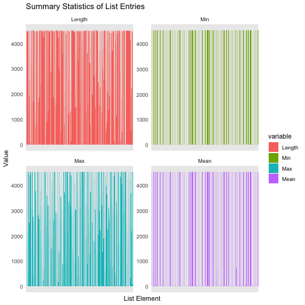

# S&P 500 Data Wrangling

## Introduction

This document demonstrates the process of wrangling stock prices data. The original data is sourced from the EIKON database and includes daily price data for individual stocks included in the S&P 500 index from 1990 to 2018. Moreover, we add the index price itself for the same observation period. The data is cleaned and aggregated to monthly frequency for further analysis.

## Workspace Setup

We begin by setting up the workspace and loading the necessary libraries.

## Load and Clean Data

### Load Data

We load the daily price data from a CSV file. The file path is dynamically defined to ensure portability.

```r
file_path <- file.path("data", "sp500_eikon_d_011990_122018.csv")
prices_sp500_d <- read.csv(file_path, header = TRUE, stringsAsFactors = FALSE) %>% as_tibble()
prices_sp500_d |> head()
```

### Format Data

We rename the date column, convert it to a `Date` format, and filter the data to include only records from 1999 onwards. Moreover, we remove columns with error flags from the EIKON database, labeled as `X.ERROR`.

```r
prices_sp500_d <- prices_sp500_d %>%
  rename(Date = Name) %>%
  mutate(Date = as.Date(Date, format = "%d.%m.%Y")) %>%
  filter(Date >= as.Date("1999-01-01")) %>%
  select(-starts_with("X.ERROR"))
```

### Remove NYSE No-Trade Dates

We identify and remove rows corresponding to NYSE holidays to ensure the data only includes trading days.

``` r
nyse_holidays <- timeDate::holidayNYSE(as.numeric(unique(format(prices_sp500_d$Date, "%Y")))) %>%
  as.Date()

prices_sp500_d <- prices_sp500_d %>%
  filter(!Date %in% nyse_holidays)
```

### Handle Missing Values

We identify columns with missing values, remove columns with more than 10% missing values,
and fill the remaining missing values using the last observation carried forward using the `zoo` package.

First, let's count the missing values for each column and analyze the results.

``` r
# count missing values for each column
nas_n <- prices_sp500_d %>%
  summarise(across(everything(), ~ sum(is.na(.)))) %>%
  unlist() %>%
  sort(decreasing = TRUE) %>%
  .[. != 0]

# analyze missing values
head(nas_n)
tail(nas_n)
length(nas_n) / ncol(prices_sp500_d)
barplot(nas_n / nrow(prices_sp500_d), names.arg = rep("", length(nas_n)), xlab = "")
```


Next, we remove columns with more than 10% missing values and fill the remaining missing values using the last observation carried forward using the `zoo` package.

``` r
prices_sp500_d <- prices_sp500_d %>%
  select(-all_of(names(nas_n)[nas_n > nrow(prices_sp500_d) * 0.1])) %>%
  mutate(across(-1, ~ zoo::na.locf0(.)))
```

Finally, we check for and remove any remaining missing values, especially leading NAs that are not handled by `na.locf0`.

``` r
leading_nas_n <- sapply(prices_sp500_d, function(col) sum(cumprod(is.na(col))))
max(leading_nas_n)
prices_sp500_d <- prices_sp500_d[-seq_len(max(leading_nas_n, na.rm = TRUE)), ]
```

### Handle Repeated Values

We identify and remove stocks with more than 10 repeated price values, as these are likely invalid data and could skew the analysis,
especially the calculation of returns and their moments.

First, we check and analyze the repeated values.

``` r
rep_vals_len <- sapply(prices_sp500_d[, -1], function(col) {
  rle_out <- rle(col)$lengths
})
str(rep_vals_len[1:10])
```

``` r
rep_vals_len_summary <- data.frame(
  Name = names(rep_vals_len),
  Length = sapply(rep_vals_len, length),
  Min = sapply(rep_vals_len, function(x) if (is.numeric(x)) min(x, na.rm = TRUE) else NA),
  Max = sapply(rep_vals_len, function(x) if (is.numeric(x)) max(x, na.rm = TRUE) else NA),
  Mean = sapply(rep_vals_len, function(x) if (is.numeric(x)) mean(x, na.rm = TRUE) else NA)
)

ggplot(
  melt(rep_vals_len_summary, id.vars = "Name"),
  aes(x = Name, y = value, fill = variable)
) +
  geom_bar(stat = "identity", position = "dodge") +
  facet_wrap(~variable, scales = "free", ncol = 2) +
  theme_minimal() +
  labs(title = "Summary Statistics of List Entries", x = "List Element", y = "Value") +
  theme(axis.text.x = element_blank(), axis.ticks.x = element_blank())
```



Then, we define a function `find_rep_vals` to identify columns with more than 10 repeated values.
After a detailed investigation and quality testing, we remove stocks with more than 10 repeated prices.

``` r
# function to find columns with more than maxrep repeated values
find_rep_vals <- function(df, maxrep = 10) {
  sapply(df, function(col) {
    if (!is.numeric(col)) {
      return(NA)
    }
    rle_out <- rle(col)
    max(rle_out$lengths, na.rm = TRUE) >= maxrep
  }) |> which()
}

# check out the stocks with more than 10 repeated prices
rep_vals_names <- names(find_rep_vals(prices_sp500_d, maxrep = 10))
rep_vals_names |> head()

# proportion of stocks with more than 10 repeated prices
length(rep_vals_names) / ncol(prices_sp500_d)

# check how many are marked as DEAD, MERGER, or DELIST
dead_or_merger <- grep("DEAD|MERGER|DELIST", rep_vals_names, value = TRUE)
dead_or_merger |> head()

length(dead_or_merger) / ncol(prices_sp500_d)

# check the rest
not_dead_or_merger <- rep_vals_names[!rep_vals_names %in% dead_or_merger]
prices_sp500_d[, not_dead_or_merger] |> head()
prices_sp500_d[, not_dead_or_merger] |> tail()

# remove stocks with more than 10 repeated prices
prices_sp500_d <- prices_sp500_d %>%
  select(-all_of(find_rep_vals(prices_sp500_d, maxrep = 10)))
```

### Turn into a dataframe

Finally, we turn the tibble into a time series dataframe and sort by column names.

``` r
prices_sp500_d <- prices_sp500_d %>%
  column_to_rownames("Date") %>%
  select(sort(names(.)))
```

## Download Daily Prices for the S&P 500 Index

We download the daily S&P 500 index prices for the same date range as the daily data and save them for later use.

``` r
prices_spx_d <- quantmod::getSymbols(
  "^GSPC",
  auto.assign = FALSE,
  from = rownames(prices_sp500_d)[1],
  to = as.character(as.Date(rownames(prices_sp500_d)[nrow(prices_sp500_d)]) + 1),
  periodicity = "daily"
)

prices_spx_d <- data.frame(date = as.Date(index(prices_spx_d)), coredata(prices_spx_d))
prices_spx_d <- prices_spx_d[, c("date", "GSPC.Adjusted")]
rownames(prices_spx_d) <- prices_spx_d$date
prices_spx_d <- prices_spx_d[, "GSPC.Adjusted", drop = FALSE]
```

### Check Overlapping Dates

We check if the date ranges of the S&P 500 index and the individual stock prices overlap and if not, we remove the non-overlapping dates.

``` r
dim(prices_sp500_d)
dim(prices_spx_d)
row_diff <- setdiff(rownames(prices_sp500_d), rownames(prices_spx_d))
row_diff
row_diff_indx <- match(row_diff, rownames(prices_sp500_d))
prices_sp500_d[(row_diff_indx - 2):(row_diff_indx + 2), 1:10]

# it seems that the values are all equal to the previous day so we can delete them
prices_sp500_d <- prices_sp500_d[-row_diff_indx, ]
```

## Convert to Monthly Data

We aggregate the daily data into monthly data for both the S&P 500 index and individual stocks.

``` r
prices_sp500_m_xts <- xts::to.monthly(xts::xts(prices_sp500_d, order.by = as.Date(rownames(prices_sp500_d))),
  indexAt = "last", OHLC = FALSE
)
prices_sp500_m <- data.frame(Date = index(prices_sp500_m_xts), coredata(prices_sp500_m_xts))
rownames(prices_sp500_m) <- prices_sp500_m$Date
prices_sp500_m <- prices_sp500_m[, -1]

prices_spx_m_xts <- xts::to.monthly(
  xts::xts(prices_spx_d, order.by = as.Date(rownames(prices_spx_d))),
  indexAt = "last", OHLC = FALSE
)
prices_spx_m <- data.frame(Date = index(prices_spx_m_xts), coredata(prices_spx_m_xts))
rownames(prices_spx_m) <- prices_spx_m$Date
prices_spx_m <- prices_spx_m[, -1, drop = FALSE]
```

## Calculate Returns

We calculate the daily and monthly log returns for both the S&P 500 index and individual stocks.

``` r
# define function for calculating returns from dataframe
calc_rets <- function(prices) {
  log(prices / lag(prices)) %>% slice(-1)
}
rets_sp500_d <- calc_rets(prices_sp500_d)
rets_sp500_m <- calc_rets(prices_sp500_m)
rets_spx_d <- calc_rets(prices_spx_d)
rets_spx_m <- calc_rets(prices_spx_m)
```

## Save Data

Finally, we save all the data to an `.RData` file for future use and as `.rda` files for including in packages.
The latter represents only a subset of the dataset for more efficient storage and loading.

``` r
save(prices_sp500_d, prices_sp500_m, rets_sp500_d, rets_sp500_m, prices_spx_d, prices_spx_m, rets_spx_d, rets_spx_m,
  file = paste0(
    "data/sp500_prices_d_m_",
    rownames(prices_sp500_d)[1], "_", rownames(prices_sp500_d)[nrow(prices_sp500_d)], ".RData"
  )
)
# Save a subset of 200 stocks from the rets_sp500 datasets
set.seed(123) # for reproducibility
subset_stocks <- sample(colnames(rets_sp500_d), 200)
rets_d <- rets_sp500_d[, subset_stocks]
rets_m <- rets_sp500_m[, subset_stocks]

save(rets_m, file = "data/rets_m.rda")
save(rets_d, file = "data/rets_d.rda")
save(rets_spx_m, file = "data/rets_spx_m.rda")
save(rets_spx_d, file = "data/rets_spx_d.rda")
```
